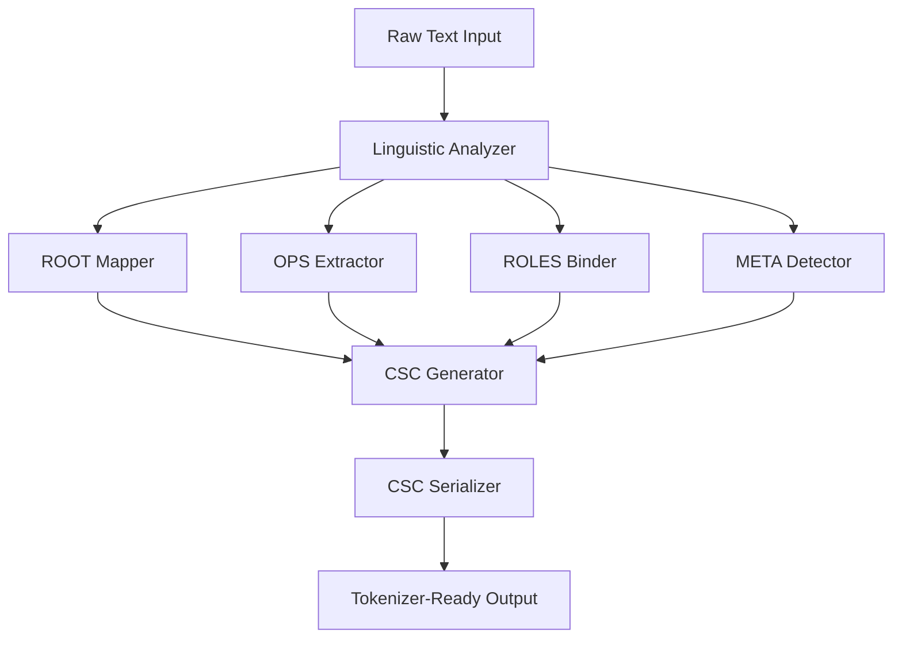

# Design Document: PTIL Semantic Encoder

## Overview

The Pre-Tokenization Intelligence Layer (PTIL) is a deterministic semantic abstraction system that operates as a preprocessing layer before standard tokenization. It converts natural language text into Compressed Semantic Code (CSC), a structured meaning representation that reduces token count by 60-80% while making semantic structure explicit.

PTIL sits between raw text and tokenizers in the AI pipeline:
```
Raw Text → PTIL Encoder → CSC → Standard Tokenizer → Transformer Model
```

The system maintains full compatibility with existing LLM architectures while providing enhanced semantic structure and cross-lingual consistency.

## Architecture

### High-Level Components



### Core Processing Pipeline

1. **Linguistic Analysis**: Shallow parsing without deep neural inference
2. **Semantic Mapping**: Convert surface forms to semantic primitives
3. **Structure Generation**: Build CSC with ROOT, OPS, ROLES, META
4. **Serialization**: Output tokenizer-friendly symbolic format

## Components and Interfaces

### 1. Linguistic Analyzer

**Purpose**: Perform shallow linguistic analysis to extract semantic information

**Interface**:
```python
class LinguisticAnalyzer:
    def analyze(self, text: str) -> LinguisticAnalysis:
        """
        Performs tokenization, POS tagging, dependency parsing,
        negation detection, and tense/aspect cue extraction
        """
```

**Key Features**:
- Tokenization and POS tagging
- Dependency parsing for syntactic relationships
- Negation marker detection
- Tense and aspect cue identification
- No deep neural inference required

### 2. ROOT Mapper

**Purpose**: Map predicates to semantic primitives from finite ROOT set

**Interface**:
```python
class ROOTMapper:
    def map_predicate(self, predicate: str, pos_context: str, 
                     dependency_context: Dict) -> ROOT:
        """
        Maps surface predicates to semantic ROOT primitives
        """
```

**ROOT Categories**:
- MOTION, TRANSFER, COMMUNICATION
- COGNITION, PERCEPTION, CREATION
- DESTRUCTION, CHANGE, POSSESSION
- INTENTION, EXISTENCE
- 300-800 total primitives (finite, mutually distinct)

### 3. OPS Extractor

**Purpose**: Extract and order semantic operators from grammatical markers

**Interface**:
```python
class OPSExtractor:
    def extract_operators(self, analysis: LinguisticAnalysis) -> List[Operator]:
        """
        Extracts ordered operators maintaining non-commutativity
        """
```

**Operator Categories**:
- **Temporal**: PAST, PRESENT, FUTURE
- **Aspect**: CONTINUOUS, COMPLETED, HABITUAL
- **Polarity**: NEGATION, AFFIRMATION
- **Modality**: POSSIBLE, NECESSARY, OBLIGATORY, PERMITTED
- **Causation**: CAUSATIVE, SELF_INITIATED, FORCED
- **Direction**: DIRECTION_IN, DIRECTION_OUT, TOWARD, AWAY

**Ordering Rule**: Left-to-right application with non-commutativity
- NEGATION(FUTURE(MOTION)) ≠ FUTURE(NEGATION(MOTION))

### 4. ROLES Binder

**Purpose**: Bind entities to semantic roles independent of word order

**Interface**:
```python
class ROLESBinder:
    def bind_roles(self, analysis: LinguisticAnalysis, 
                   root: ROOT) -> Dict[Role, Entity]:
        """
        Assigns entities to semantic roles based on ROOT requirements
        """
```

**Core Roles**:
- **AGENT**: Initiator of action
- **PATIENT**: Entity affected
- **THEME**: Entity moved/changed
- **GOAL**: Destination
- **SOURCE**: Origin
- **INSTRUMENT**: Means
- **LOCATION**: Spatial context
- **TIME**: Temporal context

**Validation**: Each ROOT defines valid ROLES (e.g., MOTION allows AGENT, THEME, SOURCE, GOAL)

### 5. META Detector

**Purpose**: Capture speech-level and epistemic information

**Interface**:
```python
class METADetector:
    def detect_meta(self, analysis: LinguisticAnalysis) -> Optional[META]:
        """
        Detects speech acts and epistemic markers
        """
```

**META Types**:
- ASSERTIVE, QUESTION, COMMAND
- UNCERTAIN, EVIDENTIAL
- EMOTIVE, IRONIC

### 6. CSC Generator

**Purpose**: Combine components into structured CSC format

**Interface**:
```python
class CSCGenerator:
    def generate_csc(self, root: ROOT, ops: List[Operator], 
                     roles: Dict[Role, Entity], 
                     meta: Optional[META]) -> CSC:
        """
        Creates structured CSC with mandatory ROOT, OPS, ROLES
        and optional META components
        """
```

**CSC Structure**:
```python
@dataclass
class CSC:
    root: ROOT
    ops: List[Operator]
    roles: Dict[Role, Entity]
    meta: Optional[META]
```

### 7. CSC Serializer

**Purpose**: Convert CSC to tokenizer-friendly symbolic text

**Interface**:
```python
class CSCSerializer:
    def serialize(self, csc: CSC) -> str:
        """
        Serializes CSC to symbolic text format:
        <ROOT=X> <OPS=Y|Z> <ROLE=ENTITY> <META=W>
        """
```

**Serialization Rules**:
- Order: ROOT → OPS → ROLES → META
- Format: `<TAG=VALUE>` for single values, `<TAG=VAL1|VAL2>` for multiple
- Flat structure compatible with BPE, Unigram, WordPiece tokenizers

## Data Models

### Core Data Structures

```python
from enum import Enum
from dataclasses import dataclass
from typing import List, Dict, Optional

class ROOT(Enum):
    MOTION = "MOTION"
    TRANSFER = "TRANSFER"
    COMMUNICATION = "COMMUNICATION"
    COGNITION = "COGNITION"
    PERCEPTION = "PERCEPTION"
    CREATION = "CREATION"
    DESTRUCTION = "DESTRUCTION"
    CHANGE = "CHANGE"
    POSSESSION = "POSSESSION"
    INTENTION = "INTENTION"
    EXISTENCE = "EXISTENCE"
    # ... up to 800 total primitives

class Operator(Enum):
    # Temporal
    PAST = "PAST"
    PRESENT = "PRESENT"
    FUTURE = "FUTURE"
    # Aspect
    CONTINUOUS = "CONTINUOUS"
    COMPLETED = "COMPLETED"
    HABITUAL = "HABITUAL"
    # Polarity
    NEGATION = "NEGATION"
    AFFIRMATION = "AFFIRMATION"
    # ... additional operators

class Role(Enum):
    AGENT = "AGENT"
    PATIENT = "PATIENT"
    THEME = "THEME"
    GOAL = "GOAL"
    SOURCE = "SOURCE"
    INSTRUMENT = "INSTRUMENT"
    LOCATION = "LOCATION"
    TIME = "TIME"

class META(Enum):
    ASSERTIVE = "ASSERTIVE"
    QUESTION = "QUESTION"
    COMMAND = "COMMAND"
    UNCERTAIN = "UNCERTAIN"
    EVIDENTIAL = "EVIDENTIAL"
    EMOTIVE = "EMOTIVE"
    IRONIC = "IRONIC"

@dataclass
class Entity:
    text: str
    normalized: str

@dataclass
class LinguisticAnalysis:
    tokens: List[str]
    pos_tags: List[str]
    dependencies: List[Tuple[int, str, int]]
    negation_markers: List[int]
    tense_markers: Dict[str, List[int]]
    aspect_markers: Dict[str, List[int]]

@dataclass
class CSC:
    root: ROOT
    ops: List[Operator]
    roles: Dict[Role, Entity]
    meta: Optional[META]
```

### ROOT-ROLES Compatibility Matrix

```python
ROOT_ROLE_COMPATIBILITY = {
    ROOT.MOTION: {Role.AGENT, Role.THEME, Role.SOURCE, Role.GOAL, Role.LOCATION, Role.TIME},
    ROOT.TRANSFER: {Role.AGENT, Role.THEME, Role.SOURCE, Role.GOAL, Role.TIME},
    ROOT.COMMUNICATION: {Role.AGENT, Role.PATIENT, Role.THEME, Role.INSTRUMENT, Role.TIME},
    ROOT.COGNITION: {Role.AGENT, Role.THEME, Role.TIME},
    ROOT.PERCEPTION: {Role.AGENT, Role.THEME, Role.INSTRUMENT, Role.TIME},
    # ... additional mappings
}
```

## Correctness Properties

*A property is a characteristic or behavior that should hold true across all valid executions of a system—essentially, a formal statement about what the system should do. Properties serve as the bridge between human-readable specifications and machine-verifiable correctness guarantees.*

Based on the prework analysis, the following properties validate the system's correctness:

### Property 1: CSC Structure Completeness
*For any* input text, the generated CSC should contain mandatory ROOT, OPS, and ROLES components, with META being optional.
**Validates: Requirements 1.1**

### Property 2: ROOT Assignment Universality
*For any* sentence, the system should map it to at least one ROOT from the finite semantic primitive set.
**Validates: Requirements 1.2, 2.3**

### Property 3: ROOT Set Constraint
*For any* generated ROOT, it should be a member of the predefined finite set of semantic primitives.
**Validates: Requirements 1.4**

### Property 4: Deterministic Processing
*For any* input text, processing it multiple times should produce identical CSC output.
**Validates: Requirements 1.5**

### Property 5: Predicate Consistency
*For any* set of semantically equivalent predicates (like "go", "walk", "travel"), they should map to the same ROOT.
**Validates: Requirements 2.2**

### Property 6: Multiple Predicate Handling
*For any* sentence containing multiple predicates, the system should generate multiple CSC instances as needed.
**Validates: Requirements 2.5**

### Property 7: Temporal Operator Extraction
*For any* text containing temporal markers, the system should apply appropriate temporal operators (PAST, PRESENT, FUTURE).
**Validates: Requirements 3.1**

### Property 8: Negation Operator Application
*For any* text containing negation markers, the system should apply the NEGATION operator.
**Validates: Requirements 3.2**

### Property 9: Aspect Operator Extraction
*For any* text containing aspectual markers, the system should apply appropriate aspect operators.
**Validates: Requirements 3.3**

### Property 10: Operator Non-Commutativity
*For any* combination of operators, applying them in different orders should produce different results when the operators don't commute.
**Validates: Requirements 3.4**

### Property 11: Subject-Agent Binding
*For any* sentence with an agentive subject, the subject should be bound to the AGENT role where semantically appropriate.
**Validates: Requirements 4.1**

### Property 12: Object Role Binding
*For any* sentence with direct objects, they should be bound to PATIENT or THEME roles based on ROOT requirements.
**Validates: Requirements 4.2**

### Property 13: Prepositional Role Binding
*For any* sentence with prepositional phrases, they should be bound to appropriate semantic roles (GOAL, SOURCE, LOCATION).
**Validates: Requirements 4.3**

### Property 14: ROOT-ROLE Compatibility
*For any* CSC, all assigned ROLES should be compatible with the identified ROOT according to the compatibility matrix.
**Validates: Requirements 4.4**

### Property 15: Linguistic Analysis Completeness
*For any* input text, the linguistic analysis should include tokenization, POS tagging, dependency parsing, and marker detection.
**Validates: Requirements 5.1, 5.2**

### Property 16: Disambiguation Consistency
*For any* ambiguous input, ROOT mapping should be resolved consistently using POS tags and dependency context.
**Validates: Requirements 5.4**

### Property 17: Serialization Format Validation
*For any* CSC, the serialized output should be symbolic text format (not JSON) with components ordered as ROOT → OPS → ROLES → META.
**Validates: Requirements 6.1, 6.2**

### Property 18: Tokenizer Compatibility
*For any* serialized CSC output, it should be processable by standard tokenizers (BPE, Unigram, WordPiece) without errors.
**Validates: Requirements 6.5**

### Property 19: Token Reduction Efficiency
*For any* typical text input, the CSC representation should achieve 60-80% token reduction compared to raw text.
**Validates: Requirements 7.1**

### Property 20: Training Integration Format
*For any* CSC output intended for training, it should be formatted as [CSC_SERIALIZATION] + [ORIGINAL_TEXT].
**Validates: Requirements 8.1**

### Property 21: Cross-Lingual Consistency
*For any* semantically equivalent sentences in different languages, they should generate identical CSC representations.
**Validates: Requirements 9.1, 9.5**

### Property 22: Language-Independent ROOT Usage
*For any* supported language, the system should use the same language-independent ROOT primitive set.
**Validates: Requirements 9.2**

## Error Handling

### Input Validation Errors
- **Malformed Input**: Return structured error with input position and expected format
- **Unsupported Language**: Graceful degradation with warning and best-effort processing
- **Empty Input**: Return empty CSC list with appropriate metadata

### Processing Errors
- **ROOT Mapping Failure**: Fall back to generic ROOT (e.g., EXISTENCE) with confidence score
- **Role Binding Conflicts**: Resolve using priority order: AGENT > PATIENT > THEME > others
- **Operator Extraction Ambiguity**: Apply most specific operator based on context

### Serialization Errors
- **Invalid CSC Structure**: Validate and repair missing mandatory components
- **Tokenizer Incompatibility**: Escape special characters and ensure flat format

### Error Recovery Strategy
1. **Graceful Degradation**: Always produce valid CSC even with reduced accuracy
2. **Confidence Scoring**: Attach confidence scores to uncertain mappings
3. **Fallback Mechanisms**: Use default values for missing components
4. **Error Logging**: Comprehensive logging for debugging and improvement

## Testing Strategy

### Dual Testing Approach

The PTIL system requires both unit testing and property-based testing for comprehensive validation:

**Unit Tests** focus on:
- Specific examples demonstrating correct behavior
- Edge cases and error conditions
- Integration points between components
- Concrete serialization examples (e.g., "The boy will not go to school tomorrow")

**Property-Based Tests** focus on:
- Universal properties that hold across all inputs
- Comprehensive input coverage through randomization
- Semantic consistency across languages
- Structural invariants of CSC generation

### Property-Based Testing Configuration

**Framework Selection**: 
- **Python**: Hypothesis library for comprehensive property testing
- **TypeScript/JavaScript**: fast-check for web-based implementations
- **Java**: junit-quickcheck for enterprise environments

**Test Configuration**:
- Minimum 100 iterations per property test
- Each property test references its design document property
- Tag format: **Feature: ptil-semantic-encoder, Property {number}: {property_text}**

**Generator Strategy**:
- **Smart Text Generators**: Create linguistically valid sentences with controlled complexity
- **Cross-Lingual Generators**: Generate equivalent sentences in multiple languages
- **Grammatical Marker Generators**: Systematically test tense, aspect, and negation combinations
- **ROOT-ROLE Generators**: Generate valid and invalid role combinations for compatibility testing

### Test Data Strategy

**Synthetic Data Generation**:
- Template-based sentence generation for controlled testing
- Grammatical transformation rules for systematic coverage
- Cross-lingual parallel corpus for consistency testing

**Real-World Data**:
- Multilingual parallel corpora for cross-lingual validation
- Domain-specific texts for ROOT coverage analysis
- Edge case collections for robustness testing

### Performance Testing

**Efficiency Validation**:
- Token reduction measurement across diverse text types
- Processing speed benchmarks for real-time applications
- Memory usage profiling for large-scale processing

**Scalability Testing**:
- Batch processing performance with varying input sizes
- Concurrent processing validation
- Resource utilization under load

The testing strategy ensures both correctness and efficiency while maintaining the deterministic nature of the PTIL system.